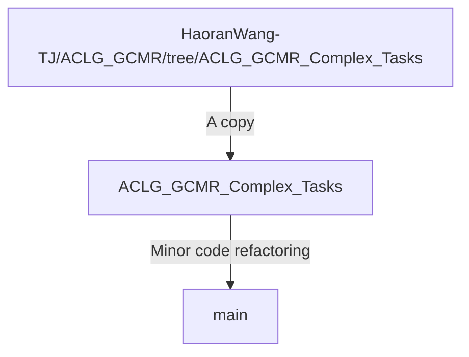

# Guided Cooperation in Hierarchical Reinforcement Learning via Model-based Rollout (GCMR)
This is a PyTorch implementation for our paper: [Guided Cooperation in Hierarchical Reinforcement Learning via Model-based Rollout](https://ieeexplore.ieee.org/document/10633748).
```bibtex
@article{wang2024guided,
  title={Guided Cooperation in Hierarchical Reinforcement Learning via Model-Based Rollout},
  author={Wang, Haoran and Tang, Zeshen and Sun, Yaoru and Wang, Fang and Zhang, Siyu and Chen, Yeming},
  journal={IEEE Transactions on Neural Networks and Learning Systems},
  year={2024},
  doi={https://doi.org/10.1109/TNNLS.2024.3425809}
}
```
Our code is based on official implementation of [HIGL](https://github.com/junsu-kim97/HIGL) (NeurIPS 2021).

By integrating the proposed GCMR and ACLG, a disentangled variant of HIGL (see ***Branch*** "[ACLG](https://github.com/HaoranWang-TJ/ACLG_GCMR/tree/ACLG)" or "[ACLG_Complex_Tasks](https://github.com/HaoranWang-TJ/ACLG_GCMR/tree/ACLG_Complex_Tasks)" in another repository [ACLG_GCMR](https://github.com/HaoranWang-TJ/ACLG_GCMR) for details), we achieved a remarkable SOTA.

### Update
:fire: [2024-10-12] We've modified the configuration of the Ant Push task, and the improved performance is presented in our latest research: "[HG2P: Hippocampus-inspired High-reward Graph and Model-Free Q-Gradient Penalty for Path Planning and Motion Control](https://arxiv.org/abs/2410.09505)" (GitHub repository: "[HaoranWang-TJ/HG2P_ACLG_official](https://github.com/HaoranWang-TJ/HG2P_ACLG_official)").

## Branch Tree
We implemented our code based on our another repository [ACLG_GCMR](https://github.com/HaoranWang-TJ/ACLG_GCMR) , which has a well-organized code structure by implementing its code 'Branch by Branch'. This repository was implemented as follows:



## Installation
```
conda create -n aclg_gcmr python=3.7
conda activate aclg_gcmr
./install_all.sh
```

Also, to run the MuJoCo experiments, a license is required (see [here](https://www.roboti.us/license.html)).

## Install MuJoCo
### MuJoCo210
1. Download the MuJoCo version 2.1 binaries for
   [Linux](https://mujoco.org/download/mujoco210-linux-x86_64.tar.gz) or
   [OSX](https://mujoco.org/download/mujoco210-macos-x86_64.tar.gz).
2. Extract the downloaded `mujoco210` directory into `~/.mujoco/mujoco210`.
```
mkdir ~/.mujoco
tar -zxvf mujoco210-linux-x86_64.tar.gz -C ~/.mujoco/
```

If you want to specify a nonstandard location for the package,
use the env variable `MUJOCO_PY_MUJOCO_PATH`.
```
vim ~/.bashrc
export LD_LIBRARY_PATH=$LD_LIBRARY_PATH:~/.mujoco/mujoco210/bin
export LD_LIBRARY_PATH=$LD_LIBRARY_PATH:/usr/lib/nvidia
source ~/.bashrc
```

### MuJoCo200
1. Download the MuJoCo version 2.0 binaries for
   [Linux](https://www.roboti.us/download/mujoco200_linux.zip) or
   [OSX](https://www.roboti.us/download/mujoco200_macos.zip).
2. Extract the downloaded `mujoco200` directory into `~/.mujoco/mujoco200`.

```
vim ~/.bashrc
export LD_LIBRARY_PATH=$LD_LIBRARY_PATH:~/.mujoco/mujoco200/bin
export LD_LIBRARY_PATH=$LD_LIBRARY_PATH:/usr/lib/nvidia
source ~/.bashrc
```

***Key license***

Also, to run the MuJoCo experiments using MuJoCo200, a license is required (see [here](https://www.roboti.us/license.html)).
```bash
e.g., cp mjkey.txt ~/.mujoco/mjkey.txt
```

## Usage
### Training & Evaluation
- Point Maze
```
./scripts/aclg_gcmr_point_maze.sh ${reward_shaping} ${timesteps} ${gpu} ${seed}
./scripts/aclg_gcmr_point_maze.sh sparse 5e5 0 2
./scripts/aclg_gcmr_point_maze.sh dense 5e5 0 2
```

- Ant Maze (U-shape)
```
./scripts/aclg_gcmr_ant_maze_u.sh ${reward_shaping} ${timesteps} ${gpu} ${seed}
./scripts/aclg_gcmr_ant_maze_u.sh sparse 7e5 0 2
./scripts/aclg_gcmr_ant_maze_u.sh dense 7e5 0 2
```

- Ant Maze (W-shape)
```
./scripts/aclg_gcmr_ant_maze_w.sh ${reward_shaping} ${timesteps} ${gpu} ${seed}
./scripts/aclg_gcmr_ant_maze_w.sh sparse 6e5 0 2
./scripts/aclg_gcmr_ant_maze_w.sh dense 6e5 0 2
```

- Reacher & Pusher
```
./scripts/aclg_gcmr_fetch.sh ${env} ${timesteps} ${gpu} ${seed}
./scripts/aclg_gcmr_fetch.sh Reacher3D-v0 5e5 0 2
./scripts/aclg_gcmr_fetch.sh Pusher-v0 5e5 0 2
```

- FetchPickAndPlace & FetchPush
```
./scripts/aclg_gcmr_openai_fetch.sh ${env} ${timesteps} ${gpu} ${seed}
./scripts/aclg_gcmr_openai_fetch.sh FetchPickAndPlace-v1 10e5 0 2
./scripts/aclg_gcmr_openai_fetch.sh FetchPush-v1 5e5 0 2
```

- Stochastic Ant Maze (U-shape)
```
./scripts/aclg_gcmr_ant_maze_u_stoch.sh ${reward_shaping} ${timesteps} ${gpu} ${seed}
./scripts/aclg_gcmr_ant_maze_u_stoch.sh sparse 7e5 0 2
./scripts/aclg_gcmr_ant_maze_u_stoch.sh dense 7e5 0 2
```

- Large Ant Maze (U-shape)
```
./scripts/aclg_gcmr_ant_maze_u_large.sh ${reward_shaping} ${timesteps} ${gpu} ${seed}
./scripts/aclg_gcmr_ant_maze_u_large.sh sparse 12e5 0 2
./scripts/aclg_gcmr_ant_maze_u_large.sh dense 12e5 0 2
```

- Ant Maze Bottleneck
```
./scripts/aclg_gcmr_ant_maze_bottleneck.sh ${reward_shaping} ${timesteps} ${gpu} ${seed}
./scripts/aclg_gcmr_ant_maze_bottleneck.sh sparse 7e5 0 2
./scripts/aclg_gcmr_ant_maze_bottleneck.sh dense 7e5 0 2
```

- Ant Push
```
./scripts/aclg_gcmr_ant_push.sh ${reward_shaping} ${timesteps} ${gpu} ${seed}
./scripts/aclg_gcmr_ant_push.sh sparse 7e5 0 2
./scripts/aclg_gcmr_ant_push.sh dense 7e5 0 2
```

- Ant Maze Complex
```
./scripts/aclg_gcmr_ant_maze_complex.sh ${reward_shaping} ${timesteps} ${gpu} ${seed}
./scripts/aclg_gcmr_ant_maze_complex.sh sparse 30e5 0 2
./scripts/aclg_gcmr_ant_maze_complex.sh dense 30e5 0 2
```